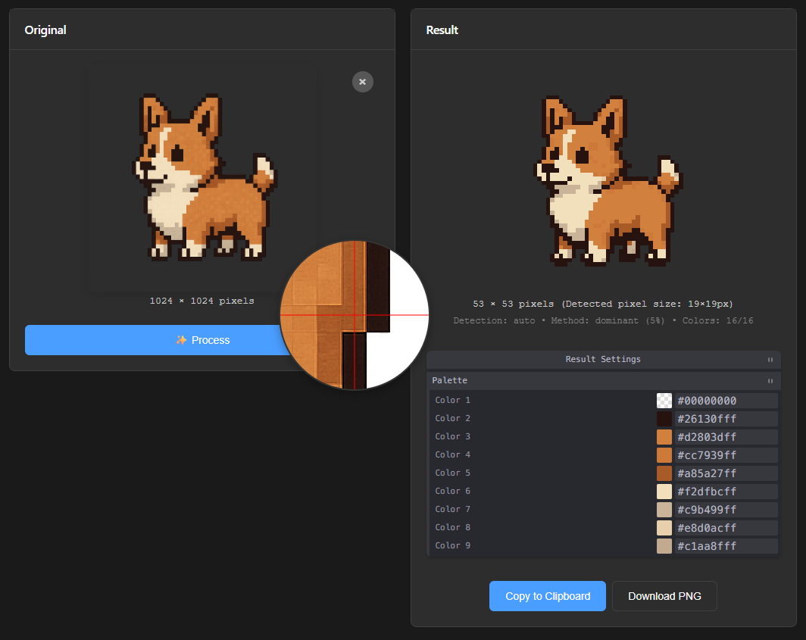
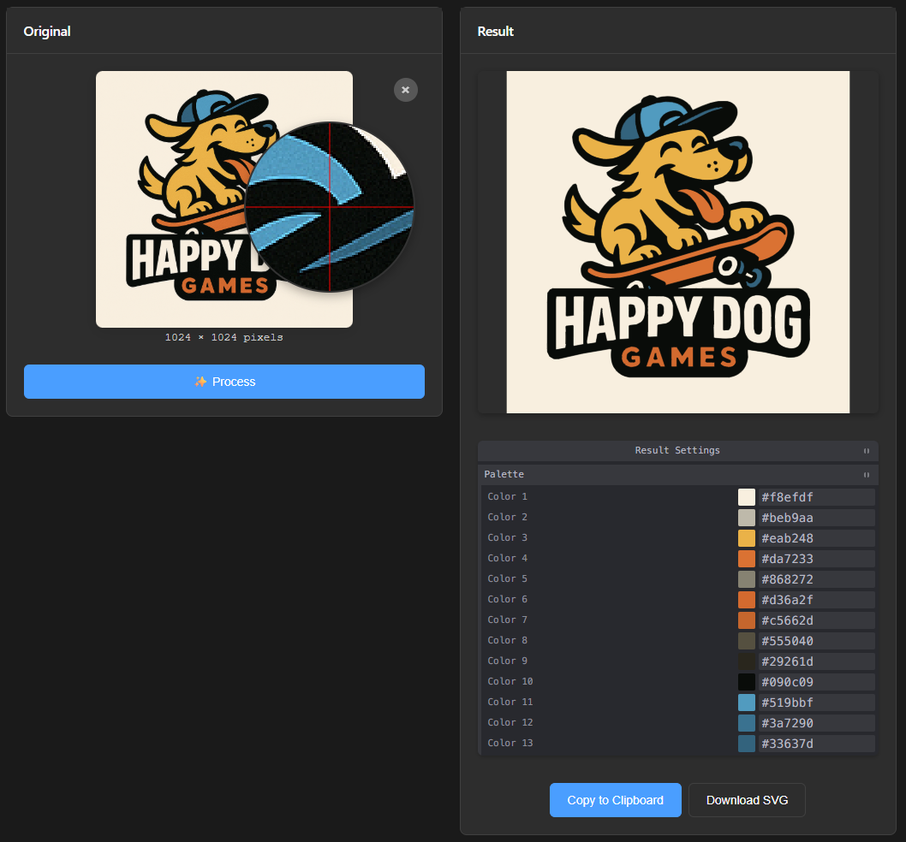

# unfake.js

**unfake.js** is a versatile JavaScript library designed to bridge the gap between AI-generated images and clean, usable assets. It offers two primary modes of operation: a powerful **Pixel Art Processor** and a sophisticated **Image Vectorizer**. The library is bundled with a feature-rich browser-based tool for easy, interactive use.




## Features

### 1. Pixel Art Processor
This mode is tailored for cleaning up pixel art, especially pieces generated by AI that often suffer from inconsistent pixel sizes, color bleeding, and other artifacts.

- **Intelligent Scale Detection**: Automatically detects the "true" pixel size of an upscaled pixel art image using `runs-based` or `edge-aware` algorithms. It can also accept a manual scale factor.
- **Content-Aware Downscaling**: Provides multiple high-quality downscaling methods (`dominant`, `median`, `content-adaptive`, etc.) to reduce the image to its native 1x scale without introducing new colors or blurriness.
- **Grid Snapping**: Automatically crops the image to align it perfectly with the detected pixel grid, ensuring clean edges.
- **Color Quantization**: Reduces the color palette to a specified maximum number of colors using the high-quality `image-q` library, with support for fixed custom palettes.
- **Artifact Cleanup**: Includes optional post-processing steps like morphological cleanup (to fill holes and remove noise) and jaggy cleanup.
- **Alpha Channel Processing**: Supports alpha binarization to create sharp, clean transparency.

### 2. Image Vectorizer
This mode converts raster images (PNG, JPG) into clean, scalable SVG files. It's an intelligent wrapper around `imagetracer.js` with extensive pre- and post-processing capabilities powered by `OpenCV.js`.

- **Noise Reduction Pre-Processing**: Applies filters like `Bilateral` or `Median` blur before vectorization to reduce noise and create smoother outlines.
- **Smart Color Quantization**: Reduces and simplifies the color palette *before* tracing for cleaner vector shapes. It can even auto-detect the optimal number of colors.
- **Background Handling**: Intelligently handles transparent images by adding a temporary background during processing to prevent edge artifacts, which is then removed from the final SVG.
- **Post-Quantization Smoothing**: Applies a gentle blur *after* color reduction to soften jagged edges before the final trace.
- **Fine-Tuned Tracing**: Exposes detailed `imagetracer.js` options for fine-grained control over the final vector output.
- **Palette Extraction**: Extracts the final color palette from the generated SVG.

## Browser Tool

The project includes a browser-based tool (`/browser-tool`) that provides a user-friendly interface for all of the library's features.

- **Dual Modes**: Easily switch between Pixel Art and Vectorization modes.
- **Live Settings Control**: Use the `Tweakpane` panel to adjust all processing parameters in real-time.
- **Drag-and-Drop & Paste**: Upload images by dragging them onto the window, selecting a file, or pasting directly from the clipboard.
- **Before/After View**: Instantly see the original and processed images side-by-side.
- **Magnifier Tool**: A built-in magnifying glass to inspect pixel-level details on both the original and result images.
- **Palette Editor**: View the result's color palette and interactively replace colors.
- **Download & Copy**: Download the final asset (`.png` for pixel art, `.svg` for vector) or copy it directly to the clipboard.

## How to Use

### Running the Browser Tool Locally

> ⚠️ **You need a local server!**
>
> Modern browsers do not allow ES module imports (importmap, type="module") from local files (`file://`). To use the browser tool, you must run it via a local http(s) server.

**Quick ways to start a server:**

- **Python 3.x** (from the project root):
  ```sh
  python -m http.server 8080
  # or
  python3 -m http.server 8080
  ```
  Then open: http://localhost:8080/browser-tool/

- **Node.js (http-server):**
  ```sh
  npx http-server -p 8080
  ```
  Then open: http://localhost:8080/browser-tool/

- **VSCode Live Server:**
  Click "Go Live" at the bottom of VSCode and select the `browser-tool` folder.

---

1. Start a local server using one of the methods above.
2. Open `http://localhost:8080/browser-tool/` in your browser (or the port you chose).
3. Upload an image, tweak the settings, enjoy!

### Using the Library (`unfake.js`) in Your Own Project

The library is written as ES modules. You can import and use its core functions `processImage` and `vectorizeImage`.

**1. Pixel Processing Example:**

```javascript
import unfake from './lib/index.js';

const fileInput = document.getElementById('my-file-input');
const file = fileInput.files[0];

const options = {
    file: file,
    maxColors: 32,
    detectMethod: 'auto', // 'auto', 'runs', 'edge'
    downscaleMethod: 'dominant',
    snapGrid: true,
    cleanup: { 
        morph: true, 
        jaggy: true 
    }
};

try {
    const { png, imageData, palette, manifest } = await unfake.processImage(options);
    
    // `png` is a Uint8Array of the final PNG file
    const blob = new Blob([png], { type: 'image/png' });
    const url = URL.createObjectURL(blob);
    
    // Now you can use the URL for an  tag or download link
    document.getElementById('result-image').src = url;

} catch (error) {
    console.error("Pixel processing failed:", error);
}
```

**2. Vectorization Example:**

```javascript
import unfake from './lib/index.js';

const fileInput = document.getElementById('my-file-input');
const file = fileInput.files[0];

const options = {
    file: file,
    preProcess: {
        enabled: true,
        filter: 'bilateral',
        value: 15
    },
    quantize: {
        enabled: true,
        maxColors: 'auto' // or a number like 16
    },
    // imagetracer.js options
    ltres: 1,
    qtres: 1,
};

try {
    const { svg, palette, manifest } = await unfake.vectorizeImage(options);
    
    // `svg` is a string containing the SVG markup
    document.getElementById('result-container').innerHTML = svg;

} catch (error) {
    console.error("Vectorization failed:", error);
}
```

## Core Dependencies

- **OpenCV.js**: For advanced image pre-processing tasks like filtering and transformations.
- **ImageTracer.js**: The core engine for the vectorization process.
- **image-q**: A high-quality library for color quantization.
- **UPNG.js**: For fast PNG encoding and decoding.
- **Tweakpane**: Used for the interactive settings UI in the browser tool.

## License

This project is licensed under the MIT License. See the [LICENSE](LICENSE) file for details.
