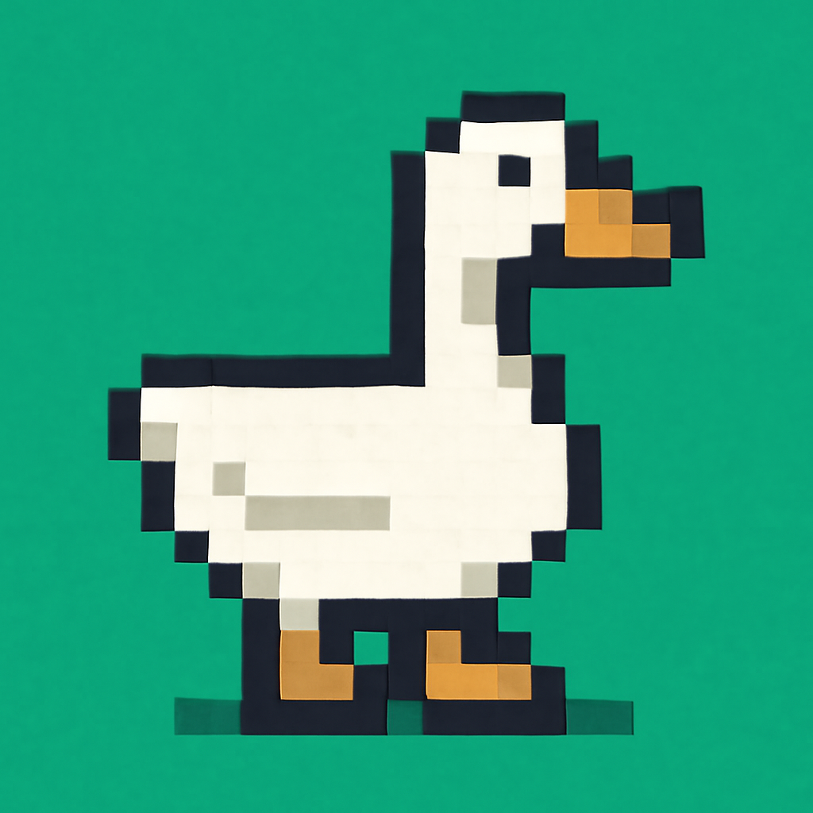
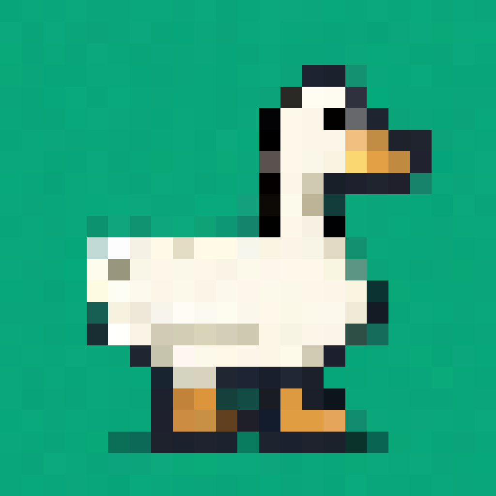
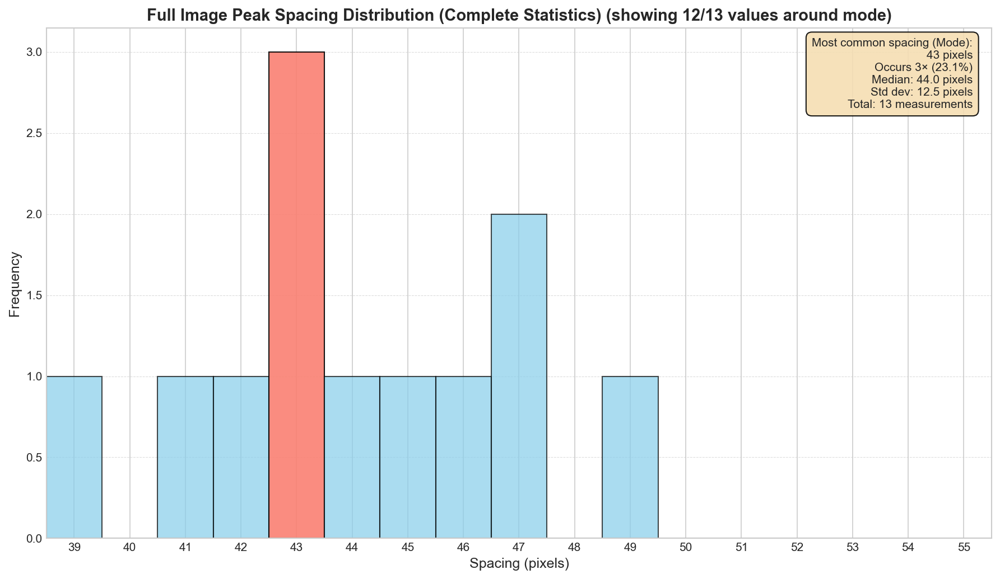
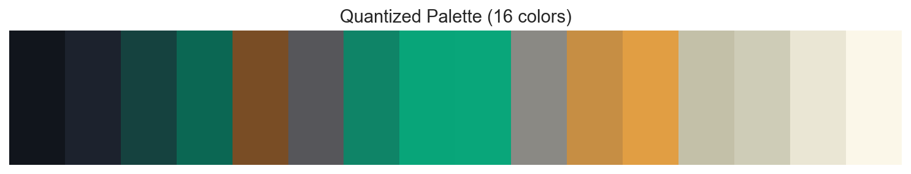
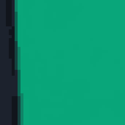
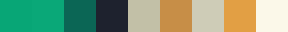
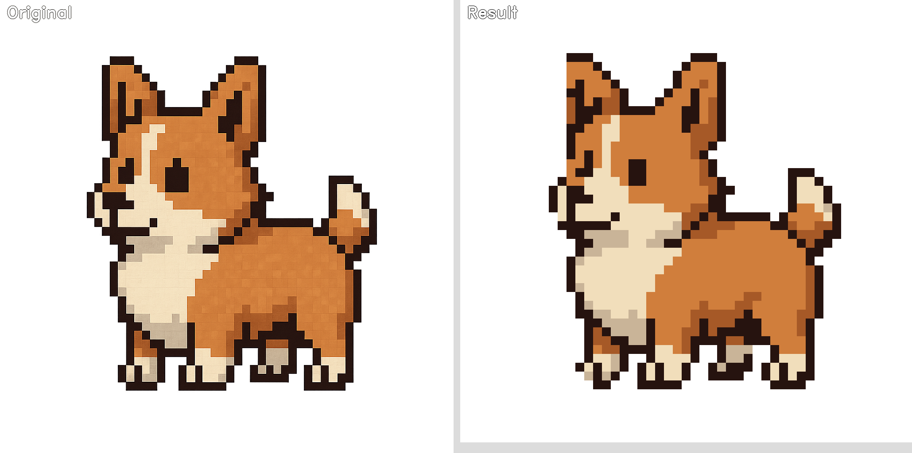

# The Art of Unfaking It: Taming AI-Generated Pixel Art

The rise of generative AI has flooded the internet with a fascinating new medium: AI-generated pixel art. These images capture the retro aesthetic we love, but they are fundamentally different from human-created art. An AI doesn't think in discrete pixels or limited palettes; it "paints" a high-resolution image that merely *looks* like pixel art.

This creates a unique set of problems. The "pixels" can have inconsistent sizes, the grid alignment is never perfect, and what appears to be a 16-color palette might actually be thousands of subtly different shades. If you try to treat this art like a simple image and resize it, you get a blurry, artifact-ridden mess.

This article explores the pipeline of `unfake.js`, a tool specifically engineered to reverse-engineer and tame the beautiful chaos of AI-generated pixel art, restoring it to a clean, usable, and truly "pixel-perfect" format.

## The Core Problem: The Illusion of the Grid

Let's start with our primary exhibit: a fantastic piece of AI-generated pixel art. At a glance, it's perfect. But the moment you zoom in, the illusion shatters.


*Our subject: a beautiful, but chaotic, AI-generated image.*

Our first challenge is to quantify this illusion. Using statistical analysis (which we'll detail later), our tool determines the most likely *scale factor* is 43. This means the AI was *aiming* for a world where each "pixel" is a 43x43 block.

But AI, not being a pixel artist, doesn't adhere to its own rules. If we overlay a naive 43x43 grid (starting at coordinate 0,0), we see the chaos in action.


*A misaligned 43x43 grid (in red). The AI-generated "pixels" spill across grid lines, never fitting neatly into the cells.*

This is problem #1. But what if we're smarter? Our tool can analyze the image to find the *optimal* grid placement. By shifting the grid, we can align it much more closely with the image content.


*An optimally aligned 43x43 grid (in green). It's better, but the problem persists. Look closely at the eye or beak—the AI's pixels are still inconsistent in size and shape, refusing to be perfectly contained.*

This reveals problem #2: **even with a perfect grid, the source pixels don't fit.** A naive "Nearest Neighbor" downscale, which simply samples one color from each cell of this new grid, still produces a corrupted result. To make the flaws obvious, we've downscaled the image and then scaled it back up.


*The disastrous result of a naive Nearest Neighbor downscale, enlarged for clarity. Shapes are broken, and details are lost because the underlying AI art has no true pixel grid.*

The final flaw is the **palette illusion**. What looks like a single shade of blue might be dozens of unique color values. A simple resizing algorithm will invent new, muddy shades, destroying the crisp, limited-palette feel.

## The Solution: A Four-Stage Pipeline

To properly "unfake" this art, we need a tool that can address these AI-specific problems. Our pipeline follows four key steps:


Let's dive into each stage and see how we solve these challenges.

---

## Stage 1: Scale Detection

The first challenge is determining what scale the AI was aiming for. By default, `unfake.js` uses **edge-aware detection** - a computer vision approach that analyzes pixel boundaries to find the most likely scale factor.

Here's how it works:

### Step 1: Analyze Representative Tiles

Instead of processing the entire image, we select multiple content-rich tiles for analysis. Our algorithm scans a 3×3 grid across the image, automatically discarding empty or low-detail areas.


*A 150x150 pixel tile chosen for its high level of detail.*

### Step 2: Edge Detection with Sobel Filter

We use the Sobel operator to detect sharp color changes that represent pixel boundaries:

| Vertical Edges (Sobel X) | Horizontal Edges (Sobel Y) |
| :---: | :---: |
|  |  |

### Step 3: Profile Generation

We collapse the 2D edge maps into 1D profiles by summing brightness values:


*The horizontal profile with detected peaks marking grid line positions.*

### Step 4: Scale Determination

For robust scale detection, `unfake.js` analyzes multiple content-rich tiles across the image, voting on the most likely grid size. This approach ensures the algorithm is resistant to local noise and irregularities.

To visualize the overall pattern, we also compute the distribution of detected peak spacings across the entire image. This gives us a clear, global picture of the AI's intended scale:


*Analysis of the complete image reveals hundreds of peak measurements, creating a much clearer picture of the AI's intended scale. The dominant 43-pixel spacing is overwhelmingly confirmed.*

We can also visualize where the AI created the strongest "pixel boundaries" across the entire image:


*This heatmap shows gradient magnitude across the full image. Bright areas indicate strong edges where the AI created transitions between "pixels". The regular pattern confirms our grid detection algorithm is working correctly.*

---

## Stage 2: Grid Alignment & Smart Cropping

With the scale factor known, we need to align our processing grid with the image content. The `findOptimalCrop` function analyzes the image to determine the best offset for grid alignment.


*After optimal cropping, the image dimensions are perfectly divisible by our scale factor.*

This step ensures that our subsequent downscaling operations work with properly aligned pixel blocks, preventing edge artifacts and maintaining the integrity of the original design.

---

## Stage 3: Color Quantization

AI-generated images often contain thousands of subtly different colors that appear as a simple palette to the human eye. We need to consolidate this chaos into a clean, deliberate palette.


*The original color chaos: hundreds of unique colors forming gradients instead of discrete palette entries.*

`unfake.js` uses K-Means clustering to group similar colors and find representative centers for each group:


*The clean, quantized 16-color palette.*

This pre-quantization is crucial because it ensures our downscaling step only works with known colors, preventing the creation of unwanted intermediate shades.

---

## Stage 4: Downscaling

With our perfectly aligned and color-corrected image, we can now downscale. The default method uses a **democratic approach**: for each block, it counts every color and selects the most frequently occurring one.

| 1. The Block | 2. Color Analysis | 3. The Winner |
| :---: | :---: | :---: |
|  |  |  |

The logic is simple and effective:

1. **Isolate the Block:** Look at a single 43×43 block from our aligned image
2. **Count the Votes:** Tally every unique color inside it
3. **Pick the Winner:** The most frequent color wins. If no color is dominant enough (>5% threshold), use the average color instead

This preserves the integrity of the original palette while making intelligent decisions based on block content.

---

## Stage 5: Final Cleanup

After downscaling, `unfake.js` applies final cleanup procedures to eliminate remaining artifacts:

- **Binary Alpha:** Ensures pixels are either fully transparent or fully opaque
- **Noise Removal:** Cleans up stray pixels and fills small holes
- **Jaggy Cleaning:** Removes isolated diagonal pixels that create unwanted artifacts

### The Final Result


*The final, pixel-perfect result, enlarged for clarity. Clean, crisp, and true to the spirit of the original art.*

### Final Palette

After all processing steps, the final image uses only these colors:


*The actual palette of the cleaned, downscaled image. Only the most essential colors remain.*

---

## Technical Analysis Report

*Processing results for the sample goose image:*

```
Scale detected: 43
Optimal crop offset: x=23, y=22
Cropped image size: 989 x 989
Original palette size: 25116 colors
Quantized palette size: 16 colors
Blocks: 23 x 23
Demo block dominant color: #09a67a (50.1%)
Fallback to mean color: No
```

---

## More Examples




---

## Conclusion: From Chaos to Craft

AI-generated pixel art represents a fascinating intersection of modern technology and retro aesthetics. While these images capture the visual appeal of pixel art, they lack the structural discipline that makes pixel art functional and editable.

`unfake.js` bridges this gap by reverse-engineering the AI's intent and imposing the mathematical precision that pixel art demands. Through intelligent edge-aware scale detection, surgical grid alignment, K-means color quantization, and democratic dominant-color downscaling, we can transform chaotic AI output into clean, structured artwork.

The result is pixel art that maintains the spirit of the original while gaining the precision and editability that the medium demands. What was once a beautiful illusion becomes genuine, grid-aligned pixel art ready for games, animation, or further artistic refinement. 