# Искусство «распикселивания»: как приручить AI-пиксель-арт

С появлением генеративных нейросетей интернет наводнили новые «пиксельные» картинки. На первый взгляд — чистый ретро-арт, но на самом деле это не настоящая пиксельная графика. AI не думает дискретными пикселями и не ограничен палитрой: он «рисует» высокоразрешённое изображение, которое только выглядит как пиксель-арт.

Из-за этого возникают уникальные проблемы: «пиксели» разного размера, сетка плавает, а вместо 16 цветов — тысячи оттенков. Если просто уменьшить такое изображение, получится мыльная каша.

В этой статье мы разберём пайплайн unfake.js — инструмента, который превращает хаос AI-арта в чистый, пригодный для работы пиксель-арт.

## Главная проблема: иллюзия сетки

Вот наш подопытный — AI-сгенерированный гусь:

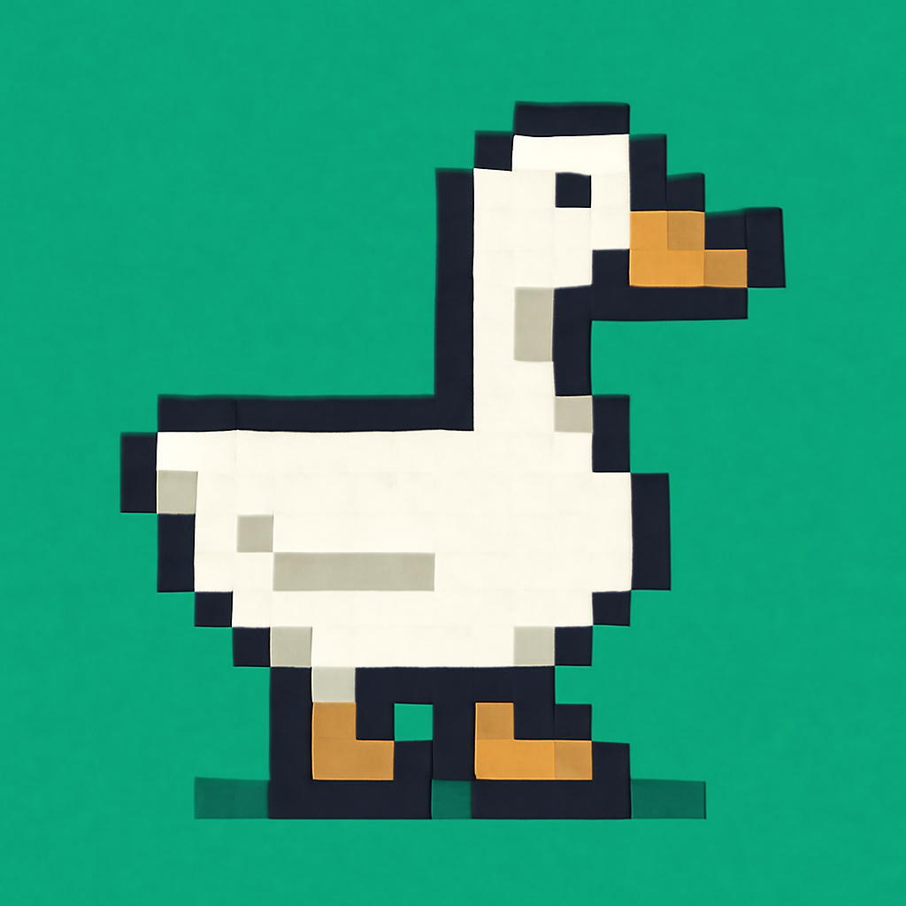
*Наш объект: красивый, но хаотичный AI-арт.*

AI как бы «целится» в сетку 43×43, но не попадает. Если наложить на картинку наивную сетку 43×43 (от 0,0), видно хаос:


*Наивная сетка (красная) не совпадает с «пикселями» AI.*

Если сдвинуть сетку оптимально, становится лучше, но всё равно не идеально:


*Оптимально сдвинутая сетка (зелёная). Всё равно пиксели AI не вписываются идеально.*

Даже если сетка совпала, пиксели внутри неё всё равно «плавают». Если просто уменьшить картинку по сетке, получится вот так:

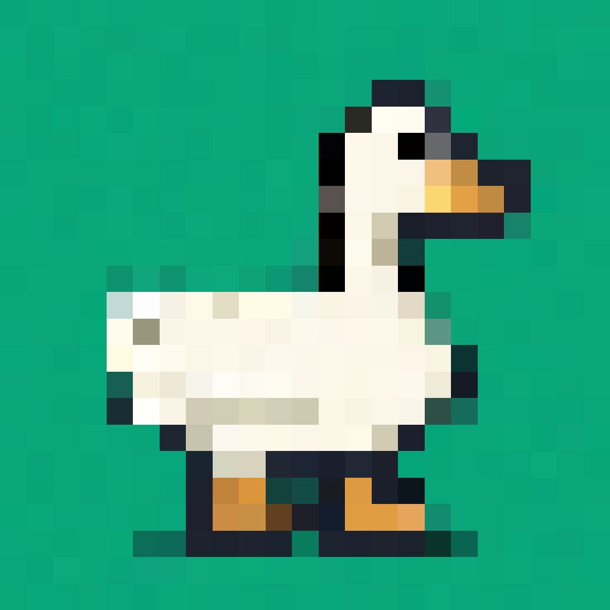
*Наивное уменьшение и увеличение. Всё ломается, потому что у AI нет настоящей пиксельной сетки.*

Последняя проблема — иллюзия палитры. То, что кажется одним цветом, на самом деле десятки оттенков. Простое уменьшение только усугубит ситуацию.

---

## Решение: пайплайн из 5 этапов

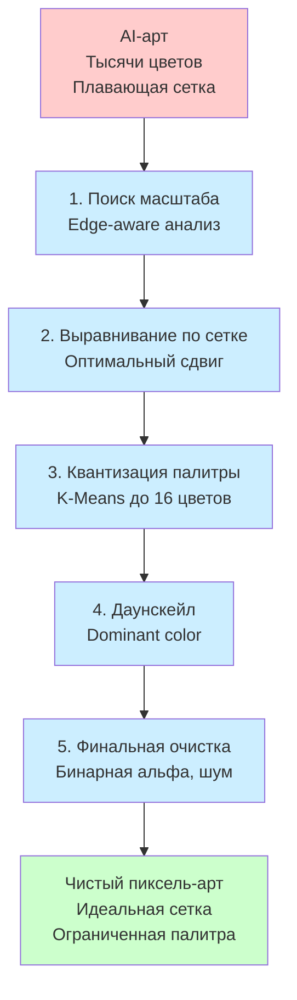

---

## Этап 1: Поиск масштаба (Scale Detection)

Для надёжного поиска масштаба unfake.js анализирует несколько информативных тайлов по всей картинке и «голосует» за наиболее вероятный размер сетки. Это защищает от локального шума и артефактов.

Чтобы показать общую картину, мы строим распределение расстояний между пиками по всему изображению:

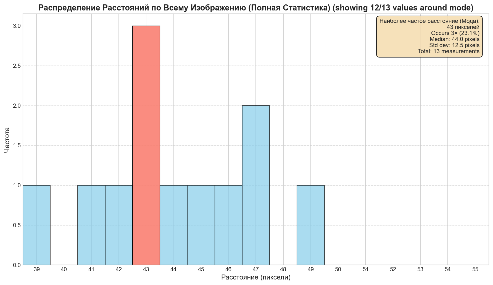
*Анализ всей картинки даёт сотни измерений. Явно видно, что AI целился в шаг 43 пикселя.*

Также можно визуализировать, где AI создавал самые сильные границы между «пикселями»:

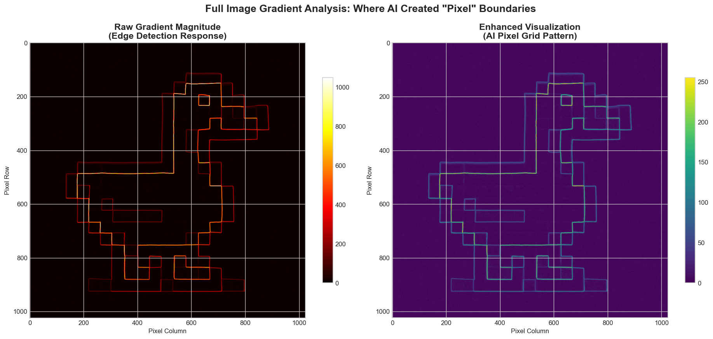
*Яркие области — сильные границы. Регулярный паттерн подтверждает корректность детекции сетки.*

---

## Этап 2: Выравнивание по сетке

Зная масштаб, мы подбираем оптимальный сдвиг, чтобы сетка максимально совпала с содержимым:

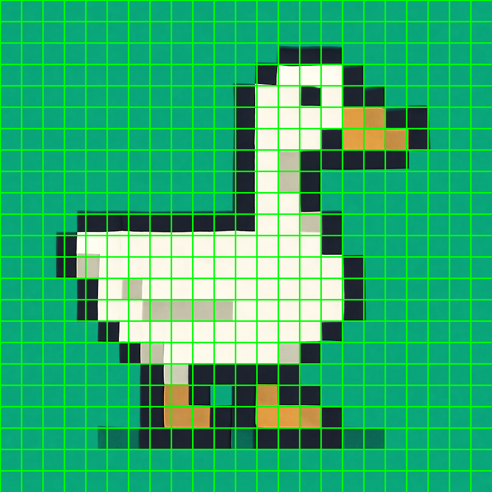
*После обрезки размеры идеально делятся на масштаб.*

---

## Этап 3: Квантизация палитры

AI-арт содержит тысячи оттенков, которые выглядят как простая палитра. Мы группируем их с помощью K-Means:

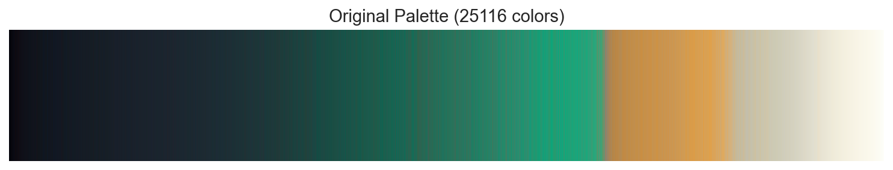
*До квантизации: сотни цветов, плавные переходы.*

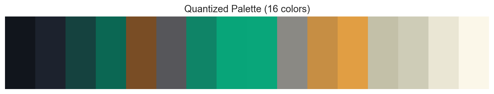
*После квантизации: чистая палитра из 16 цветов.*

---

## Этап 4: Даунскейл по доминирующему цвету

Теперь мы уменьшаем картинку, выбирая для каждого блока самый частый цвет (или средний, если нет явного лидера):

| 1. Блок | 2. Анализ цветов | 3. Победитель |
| :---: | :---: | :---: |
| 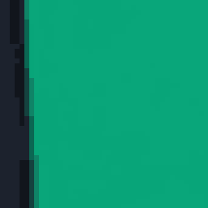 | 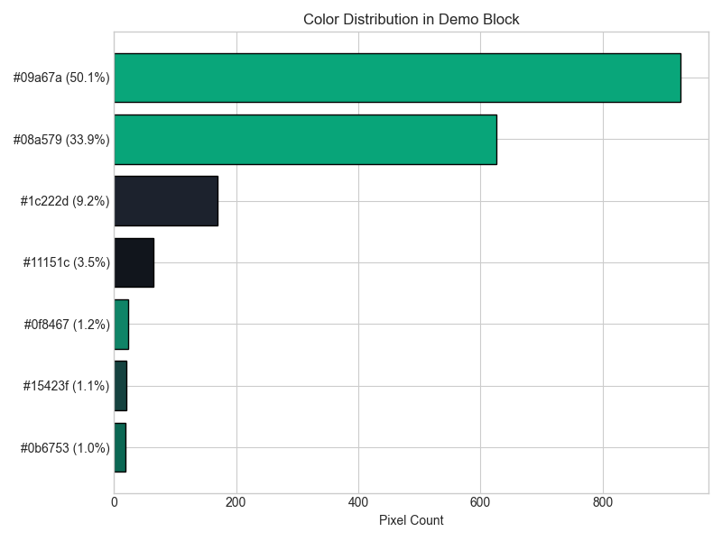 |  |

---

## Этап 5: Финальная очистка и палитра

После даунскейла мы:
- Делаем альфу бинарной
- Убираем шум и одиночные пиксели

### Финальный результат

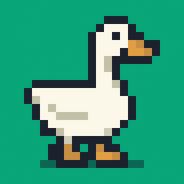
*Чистый пиксель-арт, увеличенный для наглядности.*

### Финальная палитра

После всех этапов в финальной картинке остаются только эти цвета:

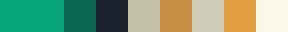
*Реальная палитра итогового изображения. Остались только самые нужные цвета.*

---

## Технический отчёт

```
Scale detected: 43
Optimal crop offset: x=23, y=22
Cropped image size: 989 x 989
Original palette size: 25116 colors
Quantized palette size: 16 colors
Blocks: 23 x 23
Demo block dominant color: #09a67a (50.1%)
Fallback to mean color: No
```

---

## Примеры

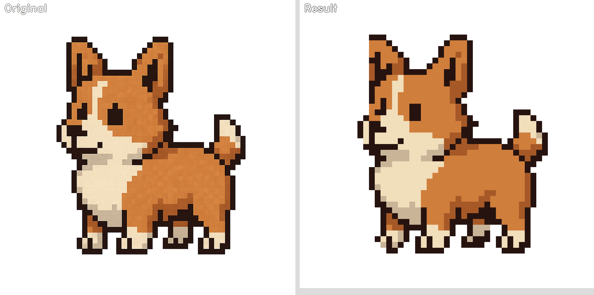
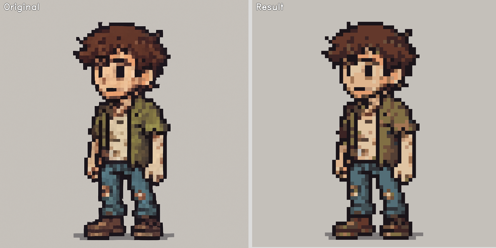
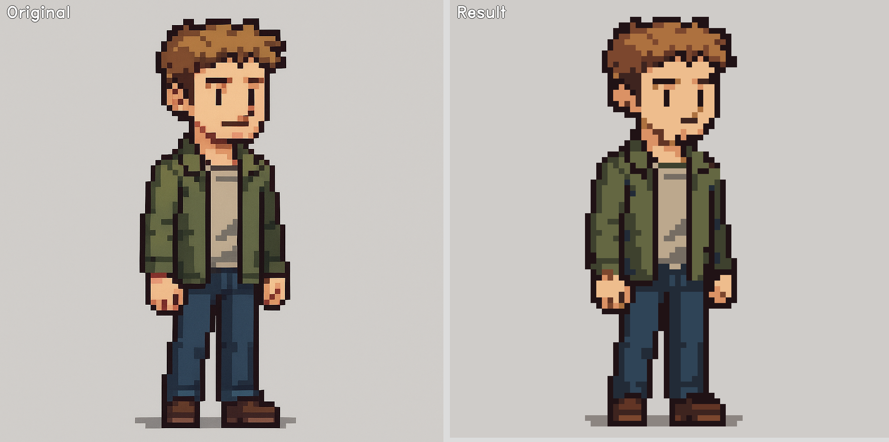
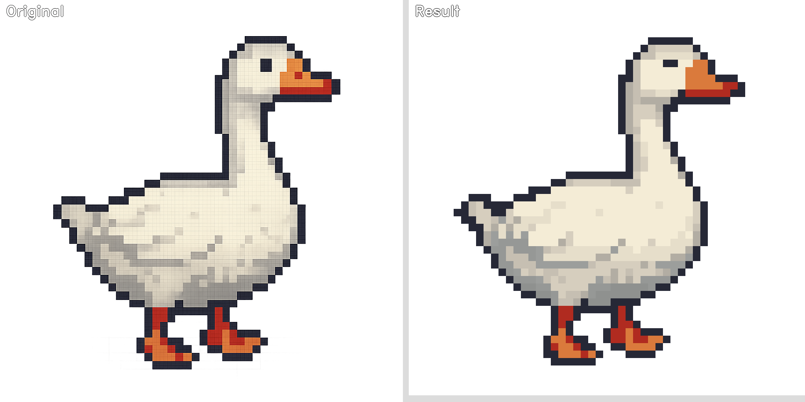

---

## Заключение

AI-пиксель-арт — это смесь ретро-стиля и хаоса. unfake.js превращает этот хаос в структурированный, пригодный для работы пиксель-арт:  
- Находит масштаб и сетку  
- Квантизирует палитру  
- Умно уменьшает и очищает  
- Оставляет только нужные цвета

В результате получается картинка, которую не стыдно использовать в играх, анимации и творчестве.

---
